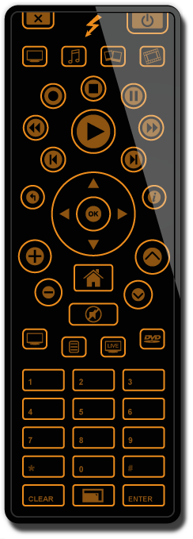
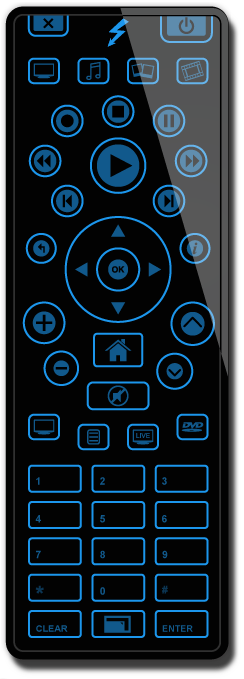
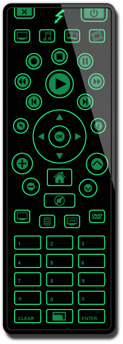
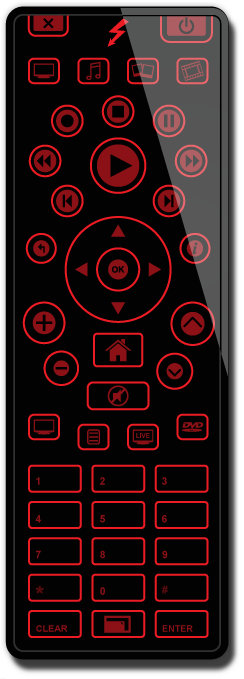
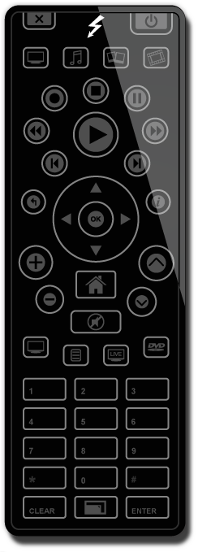
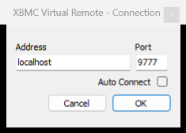

# XBMCVirtualController

<p align="center"><b>A skinnable on-screen remote control for XBMC / Kodi — a single self-contained Windows exe that drives any media centre speaking the XBMC EventServer protocol</b></p>

<p align="center">
  <a href="https://github.com/Team-Resurgent/XBMCVirtualController/blob/main/LICENSE.md"></a>
  <a href="https://github.com/Team-Resurgent/XBMCVirtualController/actions/workflows/build.yml"></a>
  <a href="https://discord.gg/VcdSfajQGK"></a>
</p>

<p align="center">
  <a href="https://ko-fi.com/J3J7L5UMN"></a>
  <a href="https://www.patreon.com/teamresurgent"></a>
</p>

<p align="center">
  <a href="https://github.com/Team-Resurgent/XBMCVirtualController/releases/latest"></a>
</p>

A desktop remote for XBMC and its descendants. The window is a genuine per-pixel-alpha
layered window — the remote is drawn from PNGs with real transparency and soft edges,
not a rectangle with a mask — and every button, hotspot and image is described by a
plain XML skin file, so new remotes are a folder of images away.

Button presses are sent over UDP to the XBMC **EventServer** (port 9777 by default),
the same protocol the official XBMC remotes use, so it drives XBMC, XBMC4Xbox and Kodi
alike without anything installed on the media centre beyond the EventServer itself.

## Skins

Six skins ship ready to use, rendered here by the app's own skin engine at 100% scale.
(A seventh folder, `Test`, is a skinner's debug template rather than a finished skin.)

<p align="center">
  
  
  
  
</p>

<p align="center">
  
  
</p>

<p align="center">
  <sub>Bradley in Amber, Blue, Green, Red and White &nbsp;·&nbsp; Xtender</sub>
</p>

Right-click the remote for the context menu: pick a skin, scale it between 50% and 100%,
toggle single-click mode, hide it to the tray, or change the connection.

## Download & run

Grab the zip from the [latest release](https://github.com/Team-Resurgent/XBMCVirtualController/releases/latest),
unzip it anywhere, and run `XBMCVirtualController.exe`.

**No .NET runtime install is required** — the exe is self-contained. Keep the `Skins`
folder next to it; that is where the app looks for skins at startup.

On first run you are asked for the address and port of your media centre:

<p align="center">
  
</p>

Tick **Auto Connect** to skip the dialog next time. Settings are stored in
`%AppData%\Team Blackbolt\XBMC Virtual Controller\settings.json`.

Make sure the EventServer is enabled on the other end — in Kodi that is
*Settings → Services → Control → Allow programs on other systems to control Kodi*.

## Building

Requires the [.NET 10 SDK](https://dotnet.microsoft.com/download). No Visual Studio needed.

```bash
dotnet build XBMCVirtualController.sln -c Release
```

To produce the shipping single-file exe:

```bash
dotnet publish XBMCVirtualController/XBMCVirtualController.csproj -c Release -o publish
```

The publish settings live in the csproj: self-contained `win-x64`, single file, compressed.
Trimming and NativeAOT are deliberately off — WinForms supports neither.

Pushing to `main` republishes the rolling `latest` release; pushing a `v*` tag cuts a
versioned release alongside it. Both are built by
[.github/workflows/build.yml](.github/workflows/build.yml).

## Writing a skin

A skin is a folder under `Skins\` containing `Skin.xml` and an `images\` folder.
`skin.xsd` in the source tree describes the schema. The shape is:

```xml
<skin>
  <version>1.0</version>
  <debug>false</debug>
  <credits>
    <skinname>My Remote</skinname>
    <info>by me</info>
  </credits>
  <layout>
    <width>244</width>
    <height>679</height>
    <texture>images\remote.png</texture>
  </layout>
  <controls>
    <control type="image" id="led">
      <xpos>106</xpos><ypos>18</ypos><width>24</width><height>30</height>
      <texture>images\led.png</texture>
    </control>
    <control type="button" id="play">
      <xpos>96</xpos><ypos>230</ypos><width>52</width><height>52</height>
      <texturehover>images\play.png</texturehover>
      <textureclick>images\play.png</textureclick>
      <buttoncommand>R1, play</buttoncommand>
    </control>
  </controls>
</skin>
```

`<buttoncommand>` is an EventServer `device, button` pair — the device defaults to `R1`
(the XBMC remote map) when omitted. An `id` of `led` is drawn only while a button is held,
and `closeprogram` quits the app instead of sending anything.

Set `<debug>true</debug>` to outline every control and show a tooltip naming whatever is
under the cursor — the fastest way to line up hotspots against artwork.

## Credits

Originally written by **Team Blackbolt** in 2009. The Bradley skins are by Bradley;
Xtender mimics the Microsoft Media Center remote.

Modernised and maintained by **Team Resurgent** — ported from .NET Framework 2.0 to
.NET 10 and repackaged as a single self-contained executable.

## Licence

GNU General Public License v3 — see [LICENSE.md](LICENSE.md).

The original Team Blackbolt release was GPL v2 *"or (at your option) any later version"*,
which is what permits redistribution under v3 here.

XBMC and Kodi are trademarks of the XBMC Foundation. This project is independent and is
not affiliated with, authorised by, or endorsed by the XBMC Foundation.
